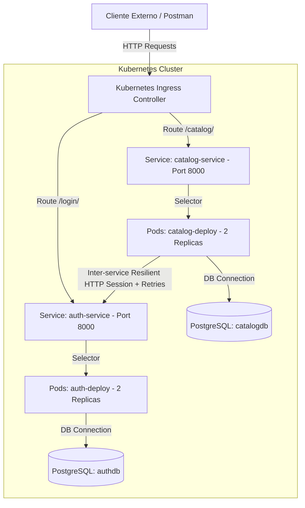

# Ecosistema de Microservicios: Auth & Catálogo (Semana 14)
Este repositorio contiene la arquitectura de referencia, la contenedorización y la orquestación para el ecosistema de microservicios Django REST Framework desplegado en Kubernetes.

**Integrantes del Grupo:**
* Sulluchuco (Arquitecto de Microservicios & DB)
* Toribio (Ingeniero de Contenedores & K8s)
* Navarro (Especialista en Comunicación & Seguridad)
* Batja (QA de Observabilidad & Escalado)
* Yauri (Integrador de APIs y Consumo)

---

## 1. Diagrama de Arquitectura
A continuación se detalla la arquitectura lógica de comunicación y red del ecosistema, desde el cliente externo hasta la persistencia separada de bases de datos.



---

## 2. Matriz de Comunicación de Microservicios

| Servicio Origen | Servicio Destino | Endpoint / Recurso | Método | Cabeceras Requeridas | Timeout | Estrategia de Resiliencia |
| :--- | :--- | :--- | :--- | :--- | :--- | :--- |
| **Cliente Externo** | `auth-service` | `/login/` | `POST` | `Content-Type: application/json` | - | - |
| **Cliente Externo** | `catalog-service` | `/catalog/` | `GET` | `Authorization: Bearer <JWT>` | - | - |
| **catalog-service** | `auth-service` | `/health/` | `GET` | `X-Request-ID`, `Authorization` | 3.0s | `HTTPAdapter` + 3 Reintentos con Backoff Exponencial (Factor: 0.5) en códigos 500, 502, 503, 504 |
| **Kubernetes (Probes)** | `auth-service` | `/health/` | `GET` | - | - | Readiness (10s delay, 5s period) / Liveness (15s delay, 10s period) |
| **Kubernetes (Probes)** | `catalog-service` | `/health/` | `GET` | - | - | Readiness (10s delay, 5s period) / Liveness (15s delay, 10s period) |

---

## 3. Evidencias de Despliegue y Pruebas (Capturas de Pantalla)

> [!NOTE]
> Reemplace los bloques de código y las imágenes indicadas abajo con las capturas obtenidas en el laboratorio de Minikube.

### A. Estado de Pods, Servicios e Ingress (`kubectl get pods,svc,ingress`)
```bash
# Copie el output real de la consola aquí
```
*Inserte la captura de pantalla aquí:*


### B. Logs de los Contenedores (Propagación del X-Request-ID y Verificación del JWT)
```bash
# Copie logs de los contenedores donde se aprecie la cabecera 'X-Request-ID' propagada
```
*Inserte la captura de pantalla aquí:*


### C. Escalado Horizontal a 3 Réplicas en Acción (`kubectl scale`)
```bash
# Copie los comandos y la salida del escalado
kubectl scale deployment/auth-deploy --replicas=3
kubectl scale deployment/catalog-deploy --replicas=3
```
*Inserte la captura de pantalla aquí:*


### D. Respuesta JWT Válida consumiendo Catálogo Protegido
```json
// Salida JSON del cliente/cURL que autentica y consulta el catálogo
```
*Inserte la captura de pantalla aquí:*


---

## 4. Preguntas de Reflexión de la Guía

### PREGUNTA 1: ¿Cuándo justifica migrar a una arquitectura de microservicios en lugar de mantener un monolito?
**Respuesta:**
La transición a microservicios se justifica bajo las siguientes circunstancias:
1. **Escalabilidad independiente:** Cuando ciertas partes de la aplicación (como el catálogo) tienen cargas extremadamente altas mientras que otras (como la administración o reportes) son de uso esporádico. Esto permite optimizar el consumo de recursos de Kubernetes asignando réplicas y recursos (CPU/Memoria) por separado.
2. **Ciclos de desarrollo y despliegues independientes:** Cuando hay múltiples sub-equipos de desarrollo trabajando sobre diferentes contextos acotados (*Bounded Contexts*). Los microservicios evitan bloqueos en lanzamientos a producción (*releases*).
3. **Heterogeneidad tecnológica:** Cuando un servicio requiere de una tecnología o lenguaje específico (por ejemplo, procesamiento de datos masivo con Python/Spark y un backend transaccional de alta concurrencia en Go).
4. **Resiliencia de fallos:** Evita que el fallo de un componente no crítico apague la aplicación por completo. En un monolito, una fuga de memoria en un reporte tumba todo el sitio; en microservicios, si el catálogo falla, el servicio de autenticación y pasarela siguen funcionando.

---

### PREGUNTA 2: ¿Qué falla primero a nivel de Kubernetes si omitimos la configuración del `readinessProbe` durante un despliegue y por qué?
**Respuesta:**
Si se omite el `readinessProbe`, ocurrirá **pérdida de tráfico o peticiones caídas (502 / 503 Bad Gateway)** durante los despliegues o actualizaciones (*Rollouts*).
- **Por qué sucede:** Por defecto, si no hay un `readinessProbe`, Kubernetes asume que el contenedor está listo para recibir tráfico inmediatamente después de que el proceso principal inicia.
- En aplicaciones de Django que arrancan mediante Gunicorn, toma unos segundos cargar los módulos en memoria y conectar con la base de datos PostgreSQL.
- Kubernetes comenzará a enviar peticiones al nuevo Pod antes de que este pueda procesarlas. Las solicitudes que lleguen durante esa ventana fallarán con errores de conexión.
- Con `readinessProbe`, el balanceador de carga del Service no redirigirá tráfico hacia el Pod hasta que este responda HTTP 200 en su endpoint `/health/`.

---

### PREGUNTA 3: ¿Cómo gestiona Kubernetes el escalado y actualización de pods sin generar interrupción del servicio (Zero-Downtime)?
**Respuesta:**
Kubernetes logra esto mediante una combinación de la estrategia de actualización **RollingUpdate**, probes de salud, y el ciclo de vida del Pod:
1. **Estrategia RollingUpdate:** Permite definir parámetros de actualización como:
   - `maxSurge`: Cuántos pods adicionales se pueden crear por encima de la cantidad deseada durante la actualización.
   - `maxUnavailable`: Cuántos pods se pueden dar de baja simultáneamente.
2. **Creación y Verificación Progresiva:** Kubernetes crea un nuevo pod con la versión actualizada. El tráfico no se redirige a este pod hasta que el `readinessProbe` devuelva HTTP 200 de forma consistente.
3. **Terminación Controlada (SIGTERM):** Una vez que el pod nuevo está listo, Kubernetes cambia el estado del pod antiguo a `Terminating`, lo remueve del balanceador del Service, y envía una señal `SIGTERM`. Esto le permite al pod antiguo terminar de procesar las conexiones activas (*Graceful Shutdown*) antes de ser destruido.
4. **Reemplazo paulatino:** El ciclo continúa de pod en pod, garantizando que siempre haya capacidad disponible respondiendo activamente peticiones.
